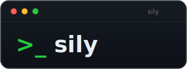

<p align="center">
  
</p>

<p align="center">
  <strong>Version control for your AI coding sessions — commit, branch, and revert like git.</strong>
</p>

<p align="center">
  <a href="https://github.com/AmitsinghTanwar007/Sily/releases"></a>
  
  
  
</p>

---

sily works across **Claude Code**, **Codex CLI**, and **OpenCode** — one tool to
browse, bookmark, and rewind sessions from any of them.

When a session is in a good state, save it with `sily commit`. Keep working — and if
it goes wrong, `sily revert` puts you right back at the good point, with the bad
version still kept. No copy-paste, no losing work.

## Install

```bash
curl -fsSL https://raw.githubusercontent.com/AmitsinghTanwar007/Sily/main/install.sh | sh
```

Installs to `/usr/local/bin` (already on your PATH, so `sily` works right away; may ask
for `sudo`).

Prefer not to use root? Install to a user directory instead:

```bash
SILY_BIN_DIR="$HOME/.local/bin" curl -fsSL https://raw.githubusercontent.com/AmitsinghTanwar007/Sily/main/install.sh | sh
```

This auto-adds the directory to your shell PATH; open a new terminal (or
`source ~/.bashrc`) once.

## Quick start

```bash
# 1. See your sessions (from every supported tool)
sily list

# 2. Save a good point (a "commit")
sily commit <session-id> -m "working great here"

# 3. ...keep working. If it goes sideways:

# 4. Go back — prints a new session id AND the exact resume command
sily revert <commit-name>

# 5. Resume that session — sily prints the right command for the tool, e.g.:
claude --resume <id>      # Claude Code
codex resume <id>         # Codex CLI
opencode --session <id>   # OpenCode
```

You are back at the good point. The messed-up version is still saved too — nothing is
ever lost.

## Commands

| Command | Description |
|---------|-------------|
| `sily list` | Interactive tree of sessions under the current directory (static when piped) |
| `sily list --all` | Every project on the machine |
| `sily log <session>` | Recent messages (last 8; `--full` for all) |
| `sily log <session> -p` | Only your prompts (skips assistant, tools, and noise) |
| `sily tree <session>` | Recent branch structure (last 8; `--full` for all) |
| `sily graph <session>` | Multi-lane rail: branches and commits split off the timeline at their exact point |
| `sily commit <session> -m "note"` | Save a point you can return to (message required; `--name`, `--at` optional) |
| `sily commits` | List your saved points |
| `sily branch <session>` | Make a new session from any point (`--at <msg>`) |
| `sily revert <commit>` | Go back to a saved point (default keeps the old version; `--hard` discards) |
| `sily merge <branch>` | Combine a branch into its main, or another branch via `--into` |
| `sily diff <a> <b>` | Show where two sessions differ |
| `sily port <session>` | Copy a session into a new session in another tool (prompts for the target) |
| `sily update` | Update sily to the latest release |

Lists show newest first.

### The graph

`sily graph <session>` (and the right pane of the interactive `sily list`) draw a
multi-lane rail: the main timeline is the trunk, each branch runs in its own parallel
lane from the message it forked at, and just-created branches appear as a stub on that
message. Conversation noise (`/exit`, `/compact`, tool and system records) is filtered
out, speakers are labelled, and the newest message is at the top.

```
> sily graph acc159f8

  acc159f8 (newest first)
    other idea done          <- branch 691f6dd9
    try the other idea
    keep going on main
    fork point here          + 42af3664 (no new conversation)
    start the project
```

### Interactive browser

In a terminal, `sily list` opens a two-pane browser: the session tree on the left, the
selected session's graph on the right.

| Key | Action |
|-----|--------|
| Up / Down | Move |
| Right / Enter | Expand (everything starts collapsed) |
| Left | Collapse |
| `y` | Copy the selected session's resume command |
| `r` | Reload (pick up changes made elsewhere) |
| `q` | Quit |

### Tips

- A commit is a tiny bookmark (a pointer), not a copy — save as many as you like.
- `revert` is safe by default: it creates a new session and leaves everything else
  intact. Use `--hard` only to truly discard the later messages.
- Most commands take an optional `--at <message-id>` to act on an exact point.
- Resume commands (copied with `y`, or printed by `branch` / `revert` / `merge`)
  include a `cd` into the session's directory when it differs from your current one,
  so you land in the right place.

## How it works

Each tool keeps its sessions on disk — Claude Code and Codex as JSONL files, OpenCode
in a SQLite database. sily reads those, slices a session at the point you choose, and
produces a new session you can resume — without calling any API. Your commits (tiny
pointers) live in `~/.sily/`.

It is built in Rust as a clean core plus pluggable adapters. Every tool is one
`impl Provider` (a trait in `sily-core`), so the CLI is identical across tools and
adding a new one is a single adapter crate.

| Tool | Browse | Commit / branch / revert | Branch point | Resume |
|------|--------|--------------------------|--------------|--------|
| Claude Code | Yes | Yes | message id | `claude --resume <id>` |
| Codex CLI | Yes | Yes | message number (`--at 3`) | `codex resume <id>` |
| OpenCode | Yes | Experimental (via its own export/import) | message id | `opencode --session <id>` |
| Gemini CLI | Yes | — | — | `gemini --resume` |
| Pi | Yes (incl. tree) | — | message id | `pi --resume <id>` |

Gemini is listing-only (its `logs.json` records only user prompts). Pi is read-only for
now (full list, log, and tree; branch and port unverified).

Write operations (`branch`, `revert`, `merge`, `port`) work for Claude Code, Codex CLI,
and OpenCode. Claude is fully verified; Codex and OpenCode writes are experimental — they
produce new sessions via each tool's own format, so confirm the resumed session looks
right. `merge` works branch-to-main and branch-to-branch (it finds the shared base and
appends the other side's work).

Where each tool's data lives: Claude `~/.claude`, Codex `~/.codex/sessions`, OpenCode its
SQLite database (`~/.local/share/opencode`), Gemini `~/.gemini/tmp/*/logs.json`, Pi
`~/.pi/agent/sessions`. Override with `SILY_CLAUDE_HOME`, `SILY_CODEX_HOME`,
`SILY_OPENCODE_DB`, `SILY_GEMINI_HOME`, `SILY_PI_DIR`.

### Move a session between tools

`sily port <session>` copies a session's conversation into a new session in a different
tool — for example, continue a Codex session over in OpenCode:

```bash
sily port <codex-session-id>      # prompts: which provider? -> opencode
```

It carries the conversation as readable context (the new session opens knowing what
happened); tool-specific execution state does not transfer. `--to <provider>` skips the
prompt. The OpenCode target is experimental — verify the result.

## License

MIT
